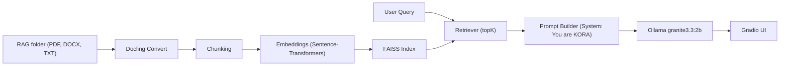

# KORA - Knowledge Oriented Retrieval Assistant

<div align="center">


</div>

KORA is a UV-based local RAG application that uses Docling for document ingestion, FAISS for vector search, and Ollama to chat with the IBM Granite 3.3:2b model. Documents are read from the `RAG/` folder and topK relevant chunks are provided as context for each query.

## Requirements
- macOS with Python 3.10+
- UV (venv already created as per instructions)
- Ollama installed and `granite3.3:2b` model already pulled

## Quickstart
```bash
# From project root
uv pip install -e .
# Launch (macOS/Linux)
./launch_kora.sh
```

For Windows (PowerShell or cmd):
```bat
launch_kora.bat
```

This will:
- Ensure dependencies are installed
- Create `RAG/` if missing
- Build the FAISS index on startup
- Launch a Gradio web UI at http://127.0.0.1:7860

## Usage
- Drop PDFs/DOCX/TXT into `RAG/`
- Use the UI to control topK and ask questions. The app retrieves topK chunks and queries Ollama `granite3.3:2b`.
- Click “Rebuild Index” after adding/removing files. A green notice confirms rebuild.

## Architecture


## Notes
- Index is stored under `.kora/index/faiss_index` and `.kora/index/meta.json`.
- To force rebuild, click the Rebuild button or delete `.kora/index`.
