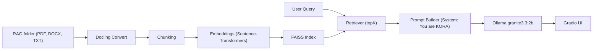

# KORA - Knowledge Oriented Retrieval Assistant

<div align="center">


</div>

KORA is a full-stack local RAG application that uses [Docling](https://github.com/docling-project/docling) for document ingestion, [FAISS](https://github.com/facebookresearch/faiss) for vector search, and [Ollama](https://ollama.com/) to chat with the [IBM Granite](https://www.ibm.com/granite) 3.3:2b model. 

Documents are read from the `RAG/` folder and topK relevant chunks are provided as context for each query. All processing is done locally, ensuring data privacy.

This tool was created for `CEE 4803 - Art & Generative AI` at the [Georgia Institute of Technology.](https://www.gatech.edu/)

## Requirements
- Python 3.10+ (uses UV for dependency management)
- Ollama installed and running on port `11434` (default)
    - ⚠️ To install Ollama, follow instructions at: https://ollama.com/download

## Quickstart
```bash
# Clone repo
git clone https://github.com/Fedele-AI/KORA.git
# Change directory
cd KORA
```

```bash
# From project root, install dependencies and package
uv pip install -e .
```

Launch Kora on macOS/Linux:
```bash
./launch_kora.sh
```

For Windows (PowerShell or cmd):
```bash
launch_kora.bat
```

This will:
- Ensure dependencies are installed
- Create `RAG/` if missing
- Build the FAISS index on startup (may take a few minutes, this is normal)
- Launch the Web UI at http://localhost:7860

---

## Usage
- Drop PDFs/DOCX/TXT into `RAG/` folder.
- The index auto-builds on first run. Subsequent runs use the existing index.
- Use the UI to control topK and ask questions. The app retrieves topK chunks and queries Ollama `granite3.3:2b`.
- Click “Rebuild Index” after adding or removing files from `RAG/`. A green notice will appear confirming the rebuild.

## Architecture


## Notes
- Index is stored under `.kora/index/faiss_index` and `.kora/index/meta.json`.
- To force rebuild, click the Rebuild button or delete `.kora/index`.
