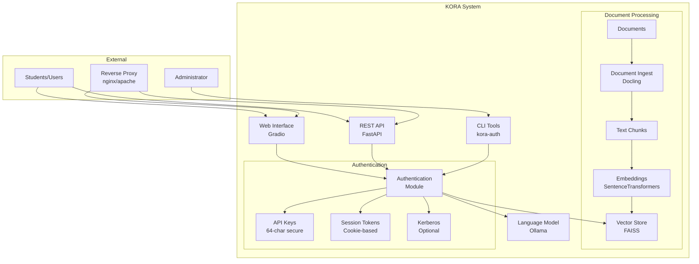
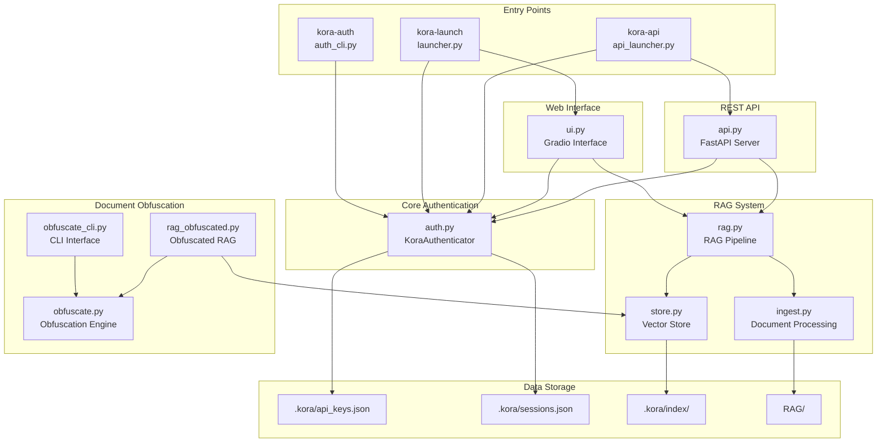

# KORA: Knowledge Oriented Retrieval Assistant

KORA is a secure, authenticated RAG (Retrieval-Augmented Generation) chatbot system designed for educational environments. It provides document-based question answering with comprehensive authentication and access control.

## Features

- **Authenticated Access**: Secure user authentication with API key generation
- **Document Processing**: Advanced document ingestion with obfuscation capabilities
- **RAG Integration**: Semantic search with FAISS vector store and Ollama LLM
- **Multiple Interfaces**: Web UI and REST API for flexible access
- **Session Management**: Cookie-based sessions for web interface
- **Reverse Proxy Ready**: Designed for deployment behind nginx/apache

## Architecture


```mermaid
graph TB
    subgraph "KORA System"
        UI[Web Interface<br/>Gradio] --> Auth[Authentication<br/>Module]
        API[REST API<br/>FastAPI] --> Auth
        Auth --> Store[Vector Store<br/>FAISS]
        Auth --> LLM[Language Model<br/>Ollama]
        
        CLI[CLI Tools<br/>kora-auth] --> Auth
        
        subgraph "Document Processing"
            Docs[Documents] --> Ingest[Document Ingest<br/>Docling]
            Ingest --> Chunks[Text Chunks]
            Chunks --> Embed[Embeddings<br/>SentenceTransformers]
            Embed --> Store
        end
        
        subgraph "Authentication"
            Auth --> Keys[API Keys<br/>64-char secure]
            Auth --> Sessions[Session Tokens<br/>Cookie-based]
            Auth --> Krb[Kerberos<br/>Optional]
        end
    end
    
    subgraph "External"
        Users[Students/Users] --> UI
        Users --> API
        Admin[Administrator] --> CLI
        Proxy[Reverse Proxy<br/>nginx/apache] --> UI
        Proxy --> API
    end
```

## Installation

### Prerequisites

- Python 3.10+
- UV package manager
- Ollama with granite3.3:2b model

### Install KORA

```bash
# Clone the repository
git clone <repository-url>
cd kora

# Install dependencies with UV
uv sync

# Install granite model in Ollama
ollama pull granite3.3:2b
```

### Optional: Kerberos Support

For production Kerberos authentication:

```bash
# Install Kerberos dependencies
uv add pykerberos

# Configure Kerberos (system-specific)
# Ensure /etc/krb5.conf is properly configured
```

## Usage

### 1. Document Setup

Place your documents in the `RAG/` directory. KORA supports various formats including PDF, DOCX, and text files.

### 2. Authentication Management

```bash
# Generate API key for a user (demo mode for testing)
uv run kora-auth generate username --demo

# Generate API key with Kerberos (production)
uv run kora-auth generate username

# List all API keys
uv run kora-auth list

# Validate an API key
uv run kora-auth validate <api-key>

# Revoke an API key
uv run kora-auth revoke <api-key>
```

### 3. Starting Services

#### Web Interface
```bash
uv run kora-launch
# Access at http://127.0.0.1:7860
```

#### REST API Server
```bash
uv run kora-api
# Access at http://127.0.0.1:8000
# API docs at http://127.0.0.1:8000/docs
```

### 4. Using the System

#### Web Interface
1. Navigate to the web interface
2. Login with your username/password or API key
3. Ask questions about the documents

#### API Access
```bash
# Login and get API key
curl -X POST http://127.0.0.1:8000/auth/login \
  -H "Content-Type: application/json" \
  -d '{"username": "user", "password": "pass", "demo_mode": true}'

# Chat with API key
curl -X POST http://127.0.0.1:8000/chat \
  -H "Authorization: Bearer <api-key>" \
  -H "Content-Type: application/json" \
  -d '{"question": "What is machine learning?", "top_k": 8}'
```

## Document Obfuscation

KORA includes advanced document obfuscation capabilities to protect sensitive content while maintaining searchability.

### How It Works

The obfuscation process operates on multiple levels:

1. **Content Analysis**: Documents are analyzed to identify sensitive information
2. **Semantic Preservation**: Key concepts are preserved while masking specifics
3. **Searchable Encryption**: Content remains searchable but protected
4. **Access Control**: Different users see different levels of detail

### Obfuscation Commands

```bash
# Process documents with obfuscation
uv run python -m kora.obfuscate_cli process --input RAG/ --output RAG_obfuscated/

# Check obfuscation status
uv run python -m kora.obfuscate_cli status

# Configure obfuscation levels
uv run python -m kora.obfuscate_cli config --level medium
```

## Authentication System

### Kerberos Implementation

KORA uses Kerberos for enterprise authentication:

- **Service Principal**: Configured for HTTP service
- **Ticket Validation**: Full Kerberos ticket validation
- **Fallback Support**: Command-line kinit fallback
- **Demo Mode**: Testing without Kerberos infrastructure

### Demo Mode vs Production

#### Demo Mode (--demo flag)
- **Purpose**: Development and testing
- **Security**: Minimal validation
- **Usage**: `kora-auth generate user --demo`
- **Authentication**: Simple username/password check

#### Production Mode
- **Purpose**: Enterprise deployment
- **Security**: Full Kerberos validation
- **Usage**: `kora-auth generate user`
- **Authentication**: Kerberos ticket validation
- **Requirements**: Proper krb5.conf configuration

### API Key Security

- **Length**: 64 characters for maximum entropy
- **Generation**: SHA256 hash + secure random data
- **Storage**: Local JSON with metadata
- **Validation**: Cryptographic verification
- **Expiration**: Configurable timeouts

## File Structure and Module Interactions


```mermaid
graph TB
    subgraph "Entry Points"
        CLI[kora-auth<br/>auth_cli.py]
        WEB[kora-launch<br/>launcher.py]
        API[kora-api<br/>api_launcher.py]
    end
    
    subgraph "Core Authentication"
        AUTH[auth.py<br/>KoraAuthenticator]
        CLI --> AUTH
        WEB --> AUTH
        API --> AUTH
    end
    
    subgraph "Web Interface"
        UI[ui.py<br/>Gradio Interface]
        WEB --> UI
        UI --> AUTH
    end
    
    subgraph "REST API"
        FASTAPI[api.py<br/>FastAPI Server]
        API --> FASTAPI
        FASTAPI --> AUTH
    end
    
    subgraph "RAG System"
        RAG[rag.py<br/>RAG Pipeline]
        STORE[store.py<br/>Vector Store]
        INGEST[ingest.py<br/>Document Processing]
        
        UI --> RAG
        FASTAPI --> RAG
        RAG --> STORE
        RAG --> INGEST
    end
    
    subgraph "Document Obfuscation"
        OBF[obfuscate.py<br/>Obfuscation Engine]
        OBFCLI[obfuscate_cli.py<br/>CLI Interface]
        RAGOBF[rag_obfuscated.py<br/>Obfuscated RAG]
        
        OBFCLI --> OBF
        RAGOBF --> OBF
        RAGOBF --> STORE
    end
    
    subgraph "Data Storage"
        APIKEYS[.kora/api_keys.json]
        SESSIONS[.kora/sessions.json]
        INDEX[.kora/index/]
        DOCS[RAG/]
        
        AUTH --> APIKEYS
        AUTH --> SESSIONS
        STORE --> INDEX
        INGEST --> DOCS
    end
```

### Core Modules

- **`kora/auth.py`**: Central authentication module managing API keys, sessions, and Kerberos integration
- **`kora/rag.py`**: Main RAG pipeline coordinating document retrieval and LLM interaction
- **`kora/ui.py`**: Gradio web interface with authentication integration
- **`kora/api.py`**: FastAPI REST endpoints for programmatic access
- **`kora/launcher.py`**: Web interface launcher with authentication setup
- **`kora/api_launcher.py`**: API server launcher and configuration
- **`kora/auth_cli.py`**: Command-line tools for API key management

### Document Processing

- **`kora/ingest.py`**: Document ingestion using Docling for format conversion
- **`kora/store.py`**: FAISS vector store management and search operations
- **`kora/obfuscate.py`**: Document obfuscation engine for content protection
- **`kora/obfuscate_cli.py`**: Command-line interface for obfuscation operations
- **`kora/rag_obfuscated.py`**: RAG pipeline specialized for obfuscated documents

### Configuration

- **`config/nginx-kora.conf`**: Nginx reverse proxy configuration
- **`config/kora-web.service`**: Systemd service for web interface
- **`config/kora-api.service`**: Systemd service for API server

## Deployment

### Development

```bash
# Start web interface
uv run kora-launch

# Start API server (separate terminal)
uv run kora-api
```

### Production with Reverse Proxy

1. **Install and configure nginx**:
   ```bash
   sudo cp config/nginx-kora.conf /etc/nginx/sites-available/kora
   sudo ln -s /etc/nginx/sites-available/kora /etc/nginx/sites-enabled/
   sudo nginx -t && sudo systemctl reload nginx
   ```

2. **Install systemd services**:
   ```bash
   sudo cp config/kora-*.service /etc/systemd/system/
   sudo systemctl daemon-reload
   sudo systemctl enable kora-web kora-api
   sudo systemctl start kora-web kora-api
   ```

3. **Configure Kerberos** (production):
   - Set up proper `/etc/krb5.conf`
   - Configure service principals
   - Test with `kinit username`

## API Endpoints

- `GET /health` - Health check
- `POST /auth/login` - User authentication
- `POST /auth/session` - Create session from API key
- `POST /chat` - Chat with API key auth
- `POST /chat/session` - Chat with session auth
- `GET /index/status` - Vector store status

## Security Considerations

- Store API keys securely (`.kora/` directory permissions)
- Use HTTPS in production
- Configure proper Kerberos realm
- Implement rate limiting at proxy level
- Regular API key rotation
- Monitor authentication logs

## Contributing

1. Fork the repository
2. Create a feature branch
3. Make changes with tests
4. Submit a pull request

## License

LGPL-3.0 - See LICENSE.md for details