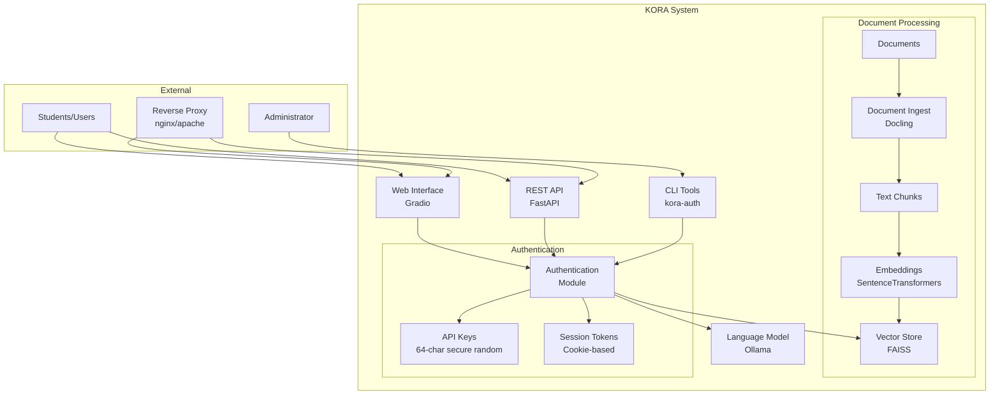
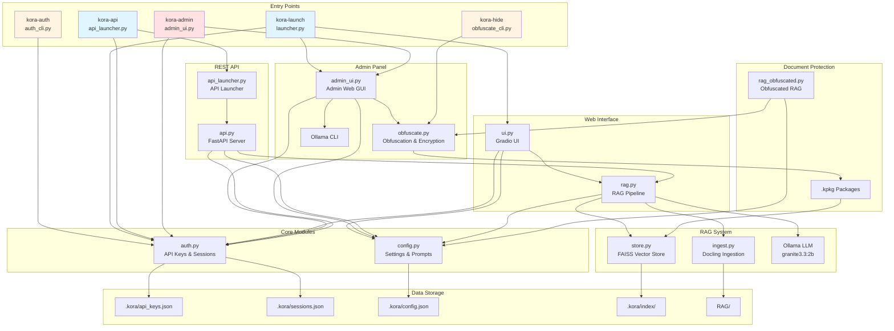

# KORA: Knowledge Oriented Retrieval Assistant

<p align="center">
  
</p>

KORA is a secure, authenticated RAG (Retrieval-Augmented Generation) chatbot system designed for educational environments. It provides document-based question answering with comprehensive authentication and access control.

**Design & development: Kenneth Jenkins, concept & direction: Francesco Fedele, [Georgia Tech](https://gatech.edu)**

## Quick Start

```bash
# 1. Install dependencies
uv sync

# 2. Install the LLM model
ollama pull granite3.3:2b

# 3. Generate an API key
uv run kora-auth generate --username your-name

# 4. Launch the web interface
uv run kora-launch
# Visit http://127.0.0.1:7860
```

## Features

### 🔐 Security & Authentication
- **API Key Management**: Secure 64-character API keys with CLI-based generation
- **Session Management**: Cookie-based sessions for web interface
- **Document Protection**: Custom .kpkg format with optional encryption

### 📚 Document Processing
- **Advanced Ingestion**: Document processing via Docling (PDF, DOCX, TXT, etc.)
- **Protected Packages**: .kpkg files with dual-layer obfuscation and encryption
- **Smart Loading**: Automatic detection and loading of packaged documents

### 🤖 RAG Capabilities
- **Semantic Search**: FAISS vector store with sentence-transformers embeddings
- **LLM Integration**: Ollama integration (granite3.3:2b model)
- **Configurable Retrieval**: Adjustable Top-K and temperature settings

### 🎨 User Experience
- **Clean Web UI**: Modern Gradio interface with logo and organized layout
- **LaTeX Support**: Automatic math equation rendering ($...$, $$...$$)
- **Copy Functionality**: One-click copy for all responses
- **Network Access**: Available on local network, not just localhost

### 🔧 Developer Friendly
- **Multiple Interfaces**: Web UI and REST API
- **Admin Panel**: Dedicated admin web GUI for system management
- **Reverse Proxy Ready**: Designed for nginx/apache deployment
- **CLI Tools**: Command-line utilities for all operations

## Architecture


```mermaid
graph TB
    subgraph "KORA System"
        UI[Web Interface<br/>Gradio] --> Auth[Authentication<br/>Module]
        API[REST API<br/>FastAPI] --> Auth
        Auth --> Store[Vector Store<br/>FAISS]
        Auth --> LLM[Language Model<br/>Ollama]
        
        CLI[CLI Tools<br/>kora-auth] --> Auth
        
        subgraph "Document Processing"
            Docs[Documents] --> Ingest[Document Ingest<br/>Docling]
            Ingest --> Chunks[Text Chunks]
            Chunks --> Embed[Embeddings<br/>SentenceTransformers]
            Embed --> Store
        end
        
        subgraph "Authentication"
            Auth --> Keys[API Keys<br/>64-char secure random]
            Auth --> Sessions[Session Tokens<br/>Cookie-based]
        end
    end
    
    subgraph "External"
        Users[Students/Users] --> UI
        Users --> API
        Admin[Administrator] --> CLI
        Proxy[Reverse Proxy<br/>nginx/apache] --> UI
        Proxy --> API
    end
```

## Installation

### Prerequisites

- Python 3.10+
- UV package manager
- Ollama with granite3.3:2b model

### Install KORA

```bash
# Clone the repository
git clone https://github.com/Fedele-AI/KORA.git
cd kora

# Install dependencies with UV
uv sync

# Install granite model in Ollama
ollama pull granite3.3:2b
```

## Model Configuration

KORA uses a single LLM model for all users, which can be configured in two ways:

### Option 1: Admin Panel (Recommended)

1. Launch KORA with `uv run kora-launch`
2. Access the Admin Panel at http://127.0.0.1:7861
3. Use the admin token from the terminal output
4. Navigate to the "🤖 AI Settings" tab
5. Select your desired model from the dropdown and click "Set as Active Model"

### Option 2: Command-Line Flag

Override the model at launch time:

```bash
# Launch with a specific model
uv run kora-launch --model qwen2.5:3b

# Launch with any Ollama model
uv run kora-launch --model llama3.1:8b
```

**Note:** The model set via command line or admin panel applies to all users. Individual users cannot change the model - this ensures consistent responses and resource management.

## Usage

### 1. Document Setup

Place your documents in the `RAG/` directory. KORA supports various formats including PDF, DOCX, and text files.

### 2. Authentication Management

```bash
# Generate API key for a user
uv run kora-auth generate --username myusername

# Or use default username
uv run kora-auth generate

# List all API keys
uv run kora-auth list

# Validate an API key
uv run kora-auth validate <api-key>

# Revoke an API key
uv run kora-auth revoke <api-key>
```

### 3. Creating Protected Packages (Optional)

```bash
# Create a KORA package (.kpkg) from your documents
uv run kora-hide create --output course_materials.kpkg --save-password

# View package information
uv run kora-hide info course_materials.kpkg

# Test package with a query
uv run kora-hide test course_materials.kpkg --password-file course_materials.kpkg.password -q "What is AI?"
```

### 4. Starting Services

#### Web Interface (Recommended)
```bash
uv run kora-launch
```

You'll see clean startup output:
```
============================================================
  KORA: Knowledge Oriented Retrieval Assistant
============================================================

  🌐 Main Interface:
    ➜  Local:   http://127.0.0.1:7860
    ➜  Network: http://[your-ip]:7860

  🔐 Admin Panel:
    ➜  Local:   http://127.0.0.1:7861
    ➜  Network: http://[your-ip]:7861
    🔑 Token:   [your-admin-token]

  📝 Authentication: Use kora-auth to generate API keys
  🔧 API Server:     Use kora-api for REST API access
  🤖 LLM Model:      granite3.3:2b via Ollama

============================================================
```

The admin panel automatically launches alongside the main interface and provides a web GUI for:
- Managing API keys
- Creating and managing .kpkg packages
- Installing and managing Ollama models

**Note:** Save the admin token shown in the terminal - you'll need it to access the admin panel.

#### REST API Server (Optional)
```bash
uv run kora-api
# Access at http://127.0.0.1:8000
# API docs at http://127.0.0.1:8000/docs
```

#### Admin Panel (Optional - Standalone)
```bash
uv run kora-admin
# Access at http://127.0.0.1:7861
# Manage API keys, packages, and Ollama models via web GUI
```

**Note:** The admin panel is automatically launched with `kora-launch`. Use `kora-admin` only if you want to run it separately.

### 5. Using the System

#### Web Interface

The KORA web interface provides an intuitive chat-based experience for interacting with your RAG system.

##### Accessing the Interface

After running `uv run kora-launch`, access the web interface at:
- **Local access:** `http://127.0.0.1:7860`
- **Network access:** `http://[your-ip]:7860` (accessible from other devices on your network)

##### Authentication

1. When you first visit the interface, you'll see a login screen
2. Enter an API key generated using `uv run kora-auth generate --username yourname`
3. The interface uses secure session cookies to keep you logged in
4. Sessions persist across page refreshes but expire after inactivity

##### Interface Layout

The web interface features:

**Header Section:**
- KORA logo and branding
- Current LLM model display (e.g., "🤖 Current LLM Model: `granite3.3:2b` (set by admin)")
- Clean, modern design

**Chat Interface:**
- **Question input box:** Enter your questions about the documents
- **Send button:** Submit your question to the RAG system
- **Chat history:** Scrollable conversation view with all Q&A pairs
- **Copy buttons:** Click to copy any response to your clipboard

**Configuration Controls:**
- **Top-K slider (1-20):** Controls how many relevant document chunks are retrieved
  - Lower values (1-5): More focused, using fewer sources
  - Medium values (6-10): Balanced retrieval (default: 8)
  - Higher values (11-20): Broader context, more comprehensive answers
- **Temperature slider (0.0-2.0):** Controls LLM response creativity
  - Lower values (0.0-0.5): More focused, deterministic, fact-based responses
  - Medium values (0.5-1.0): Balanced responses (default: 0.7)
  - Higher values (1.0-2.0): More creative, diverse, exploratory responses

##### Features

**LaTeX Math Rendering:**
- Inline equations: Use `$...$` syntax (e.g., `$E = mc^2$`)
- Block equations: Use `$$...$$` syntax for centered equations
- Automatic rendering in all responses

**Response Copying:**
- Every response has a copy button (📋)
- One-click copying to clipboard
- Useful for saving answers or pasting into documents

**Network Accessibility:**
- Interface is accessible from any device on your local network
- Share the network URL with students/users on the same network
- No additional configuration needed for LAN access

**Model Information:**
- Current model is displayed at the top of the interface
- Model applies to all users (no per-user model selection)
- Only admins can change the active model via Admin Panel or CLI flag

##### Using the Interface

1. **Login** with your API key
2. **Type your question** in the input box (e.g., "What is machine learning?")
3. **Adjust settings** if needed:
   - Increase Top-K for more comprehensive answers
   - Adjust Temperature for more creative or focused responses
4. **Click Send** or press Enter
5. **View the response** with relevant source citations
6. **Copy responses** using the copy button if needed
7. **Ask follow-up questions** - the system retrieves fresh context for each query

**Tips:**
- Start with default settings (Top-K: 8, Temperature: 0.7) for balanced results
- For technical/factual questions, use lower temperature (0.3-0.5)
- For brainstorming or creative questions, use higher temperature (1.0-1.5)
- Increase Top-K if answers seem to miss relevant information
- Check the current model displayed at the top to know which LLM is responding

#### API Access
```bash
# Generate an API key using CLI
uv run kora-auth generate --username myuser

# Chat with API key
curl -X POST http://127.0.0.1:8000/chat \
  -H "Authorization: Bearer <api-key>" \
  -H "Content-Type: application/json" \
  -d '{"question": "What is machine learning?", "top_k": 8}'
```

## Document Protection with KORA Packages (kpkg)

KORA includes advanced document protection using a custom binary format (.kpkg files). These packages use a dual-layer protection system:

### Protection Layers

1. **Obfuscation Layer** (Always Active)
   - Content is XOR-obfuscated using a deterministic pattern
   - AI can automatically decode this layer without keys
   - Prevents casual viewing by users opening the file
   - Fast and lightweight

2. **Encryption Layer** (Optional)
   - Adds AES encryption via Fernet (symmetric encryption)
   - Requires a password/key to decompile the package
   - Protects against determined attackers
   - Use `--encrypt` flag when creating packages

### Custom KPKG Format

The .kpkg format is a custom binary structure designed for KORA:

```
[Header: 8 bytes]
  - Magic: KORA (4 bytes)
  - Version: 1 byte
  - Flags: 1 byte (encryption/compression)
  - Reserved: 2 bytes

[Metadata Section]
  - Model info, statistics, sources
  
[Embeddings Section]
  - FAISS index (serialized)
  
[Content Section]
  - Text chunks (obfuscated + optional encryption)
```

### Creating KORA Packages

```bash
# Create obfuscated-only package (AI can read without key)
uv run kora-hide create --output course_materials.kpkg

# Create encrypted package (requires key to decompile)
uv run kora-hide create --output secure_materials.kpkg --encrypt --save-password

# Create with custom password and anonymize sources
uv run kora-hide create -o data.kpkg -p mypassword --encrypt --no-include-sources

# View package information
uv run kora-hide info course_materials.kpkg

# Test package with a query
uv run kora-hide test course_materials.kpkg --query "What is AI?"

# Test encrypted package (requires password)
uv run kora-hide test secure_materials.kpkg --password-file secure_materials.kpkg.password -q "What is AI?"
```

### Using KORA Packages

Place your `.kpkg` file in the project directory and KORA will automatically detect and use it:

- **Obfuscated packages**: AI reads directly without additional passwords
- **Encrypted packages**: Requires the password from `.kpkg.password` file or manual entry
- KORA authentication (from `kora-auth`) is always required for system access

```bash
# Example workflow:
# 1. Create an obfuscated package (AI-readable)
uv run kora-hide create --output course_materials.kpkg

# 2. KORA automatically loads the package
uv run kora-launch

# 3. Users authenticate with their KORA credentials
uv run kora-auth generate student_name

# For sensitive data, use encryption:
uv run kora-hide create --output sensitive_data.kpkg --encrypt --save-password
```

## Authentication System

KORA provides a secure authentication system with API key management and session handling.

### API Key Management

Generate and manage API keys using the `kora-auth` command-line tool:

```bash
# Generate API key for a user
uv run kora-auth generate --username myusername

# List all API keys
uv run kora-auth list

# Validate an API key
uv run kora-auth validate <api-key>

# Revoke an API key
uv run kora-auth revoke <api-key>
```

### API Key Security

- **Length**: 64 characters for maximum entropy
- **Generation**: SHA256 hash + secure random data
- **Storage**: Local JSON with metadata
- **Validation**: Cryptographic verification
- **Expiration**: Configurable timeouts

## Admin Panel

KORA includes a dedicated web-based admin panel that provides a graphical interface for system management. The admin panel is automatically launched with `kora-launch` on port 7861.

### Features

The admin panel provides three main sections:

#### 🔑 API Key Management
- View all generated API keys with user information
- Generate new API keys for users
- Revoke existing API keys
- All operations available via web GUI (no CLI needed)

#### 📦 KORA Package Management
- List all .kpkg packages in the project directory
- View package information (size, modification date)
- Create new packages from the RAG/ directory
- Configure encryption settings
- Auto-generate or specify custom passwords

#### 🤖 Ollama Model Management
- Check Ollama installation and running status
- List all installed Ollama models
- Pull the default granite3.3:2b model with one click
- Pull custom models by name
- View model pull progress and status

### Security

The admin panel requires an **admin token** for authentication. This token:
- Is randomly generated on each launch
- Is printed in the terminal when `kora-launch` starts
- Must be entered in the admin panel to access any features
- Provides full administrative access to KORA

**Important:** Keep the admin token secure and do not share it. Anyone with the token has full administrative access.

### Access

When you run `kora-launch`, the admin panel is automatically started:
- **Local:** `http://127.0.0.1:7861`
- **Network:** `http://[your-ip]:7861`

You can also run the admin panel standalone:
```bash
uv run kora-admin
```

The admin token will be displayed in the terminal output.

## File Structure and Module Interactions


```mermaid
graph TB
    subgraph "Entry Points"
        CLI[kora-auth<br/>auth_cli.py]
        HIDE[kora-hide<br/>obfuscate_cli.py]
        WEB[kora-launch<br/>launcher.py]
        APICLI[kora-api<br/>api_launcher.py]
        ADMIN[kora-admin<br/>admin_ui.py]
    end
    
    subgraph "Core Modules"
        AUTH[auth.py<br/>API Keys & Sessions]
        CONFIG[config.py<br/>Settings & Prompts]
        CLI --> AUTH
        WEB --> AUTH
        APICLI --> AUTH
        ADMIN --> AUTH
    end
    
    subgraph "Web Interface"
        UI[ui.py<br/>Gradio UI]
        WEB --> UI
        UI --> AUTH
        UI --> RAG
        UI --> CONFIG
    end
    
    subgraph "Admin Panel"
        ADMINUI[admin_ui.py<br/>Admin Web GUI]
        WEB --> ADMINUI
        ADMIN --> ADMINUI
        ADMINUI --> AUTH
        ADMINUI --> OBF
        ADMINUI --> CONFIG
        ADMINUI --> OLLAMA[Ollama CLI]
    end
    
    subgraph "REST API"
        FASTAPI[api.py<br/>FastAPI Server]
        APILAUNCHER[api_launcher.py<br/>API Launcher]
        APICLI --> APILAUNCHER
        APILAUNCHER --> FASTAPI
        FASTAPI --> AUTH
        FASTAPI --> RAG
        FASTAPI --> CONFIG
    end
    
    subgraph "RAG System"
        RAG[rag.py<br/>RAG Pipeline]
        STORE[store.py<br/>FAISS Vector Store]
        INGEST[ingest.py<br/>Docling Ingestion]
        
        RAG --> STORE
        RAG --> INGEST
        RAG --> CONFIG
        RAG --> LLM[Ollama LLM<br/>granite3.3:2b]
    end
    
    subgraph "Document Protection"
        OBF[obfuscate.py<br/>Obfuscation & Encryption]
        RAGOBF[rag_obfuscated.py<br/>Obfuscated RAG]
        HIDE --> OBF
        OBF --> KPKG[.kpkg Packages]
        RAGOBF --> OBF
        RAGOBF --> CONFIG
        KPKG --> STORE
    end
    
    subgraph "Data Storage"
        APIKEYS[.kora/api_keys.json]
        SESSIONS[.kora/sessions.json]
        CFGFILE[.kora/config.json]
        INDEX[.kora/index/]
        DOCS[RAG/]
        
        AUTH --> APIKEYS
        AUTH --> SESSIONS
        CONFIG --> CFGFILE
        STORE --> INDEX
        INGEST --> DOCS
    end
    
    style WEB fill:#e1f5ff
    style APICLI fill:#e1f5ff
    style CLI fill:#fff4e1
    style HIDE fill:#fff4e1
    style ADMIN fill:#ffe1e1
```

### Core Modules

- **`kora/auth.py`**: Central authentication module managing API keys and sessions
- **`kora/config.py`**: Configuration management for models, prompts, and system settings
- **`kora/rag.py`**: Main RAG pipeline coordinating document retrieval and LLM interaction
- **`kora/ui.py`**: Gradio web interface with authentication integration
- **`kora/admin_ui.py`**: Admin panel web GUI for system management
- **`kora/launcher.py`**: Web interface launcher with clean startup output and admin panel
- **`kora/api.py`**: FastAPI REST API server with endpoints for querying and management
- **`kora/api_launcher.py`**: API server launcher and configuration
- **`kora/auth_cli.py`**: Command-line tools for API key management

### Document Processing

- **`kora/ingest.py`**: Document ingestion using Docling for format conversion
- **`kora/store.py`**: FAISS vector store management and search operations
- **`kora/obfuscate.py`**: Document obfuscation engine for content protection
- **`kora/obfuscate_cli.py`**: Command-line interface for obfuscation operations
- **`kora/rag_obfuscated.py`**: RAG pipeline specialized for obfuscated documents

## API Endpoints

The REST API (accessible via `kora-api` at `http://127.0.0.1:8000`) provides the following endpoints:

**General:**
- **`GET /`** - API information and version
- **`GET /health`** - Health check
- **`GET /status`** - System status, index statistics, and configuration (requires API key)
  - Header: `X-API-Key: <api-key>`

**RAG Operations:**
- **`POST /query`** - Submit questions and get AI-generated answers (requires API key)
  - Header: `X-API-Key: <api-key>`
  - Body: `{"question": "...", "top_k": 8, "model": "granite3.3:2b", "temperature": 0.7}`
- **`POST /search`** - Search for relevant context without generating an answer (requires API key)
  - Header: `X-API-Key: <api-key>`
  - Body: `{"query": "...", "top_k": 8}`

**Management:**
- **`POST /rebuild`** - Rebuild the vector index from documents (requires API key)
  - Header: `X-API-Key: <api-key>`
  - Body: `{"force": false}`

**Documentation:**
- **`GET /docs`** - Interactive API documentation (Swagger UI)
- **`GET /redoc`** - Alternative API documentation (ReDoc)

## Security Considerations

- **Admin Token**: Keep the admin token secure - it provides full administrative access
- Store API keys securely (`.kora/` directory permissions)
- Use HTTPS in production with reverse proxy
- Implement rate limiting at proxy level
- Regular API key rotation
- Monitor authentication logs
- Restrict network access appropriately (especially for admin panel)
- Use encrypted .kpkg packages for sensitive documents

## Contributing

1. Fork the repository
2. Create a feature branch
3. Make changes with tests
4. Submit a pull request

## Technical Details

### KPKG Binary Format Specification

The .kpkg format uses a custom binary structure for optimal performance and security:

**Header Structure (8 bytes)**:
- Magic number: "KORA" (0x4B4F5241)
- Version byte: Currently 1
- Flags byte: Bit 0 (encryption), Bit 1 (compression)
- Reserved: 2 bytes for future use

**Data Sections**:
Each section has a 4-byte length prefix (uint32, little-endian) followed by data:
1. **Metadata**: JSON with package info, model name, chunk metadata, hash
2. **Embeddings**: Serialized FAISS index for vector search
3. **Content**: Text chunks (always XOR-obfuscated, optionally encrypted)

**Security Layers**:
- **XOR Obfuscation** (always active): Simple deterministic XOR with key `KORA_OBFUSCATION_KEY_V1`
- **AES-256 Encryption** (optional): Fernet cipher with PBKDF2 key derivation (100,000 iterations)
- **Compression**: zlib compression for reduced file size

**File Size**: Typical compression ratios of 50-70% reduction compared to raw documents.

### Recent Updates

**v0.2.1 - October 2025**
- **Admin Panel**: Added dedicated web-based admin GUI (port 7861)
  - Manage API keys through web interface
  - Create and manage .kpkg packages
  - Install and manage Ollama models
  - One-click granite3.3:2b model installation
  - Secure admin token authentication
- **Improved Launcher**: Admin panel auto-launches with main interface
- **Enhanced Documentation**: Comprehensive admin panel documentation

**v0.2.0 - October 2025**
- **UI Improvements**:
  - Removed API key generation from web interface (now CLI-only)
  - Added KORA logo to README and web interface
  - Clean startup banner with local and network URLs
  - Network access enabled (not just localhost)
- **Security Enhancements**:
  - Streamlined authentication flow
  - API key generation restricted to `kora-auth` CLI tool
  - Improved session management
- **Documentation**:
  - Cleaned up authentication documentation
  - Updated mermaid diagrams for accuracy
  - Added Quick Start guide
  - Reorganized features section with emojis

**v0.1.0 - October 2024**
- Renamed `kora.obfuscate` → `kora-hide` for consistency
- Changed file extension from `.bin` → `.kpkg`
- Implemented custom binary format with dual-layer protection
- Added UI enhancements (copy button, LaTeX rendering, temperature slider)
- Auto-loading of .kpkg files in project directory

## License

LGPL-3.0 - See [LICENSE.md](LICENSE.md) for details

---

**Built with ❤️ at Georgia Tech**
