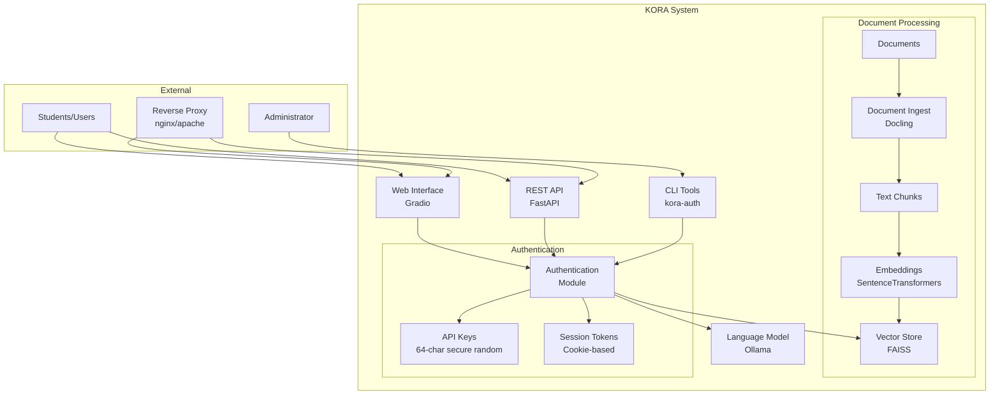
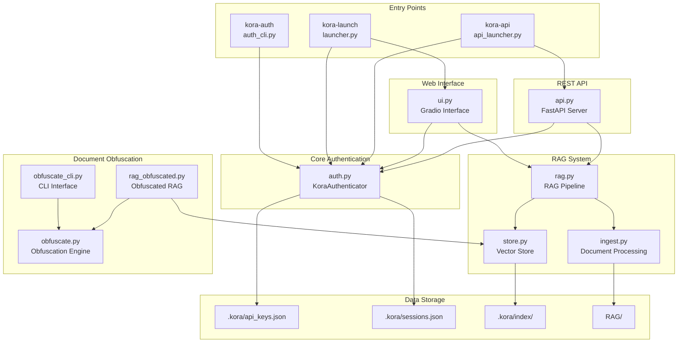

# KORA: Knowledge Oriented Retrieval Assistant

KORA is a secure, authenticated RAG (Retrieval-Augmented Generation) chatbot system designed for educational environments. It provides document-based question answering with comprehensive authentication and access control.

## Features

- **Authenticated Access**: Secure user authentication with API key generation
- **Document Processing**: Advanced document ingestion with protected package (.kpkg) capabilities
- **RAG Integration**: Semantic search with FAISS vector store and Ollama LLM
- **Multiple Interfaces**: Web UI and REST API for flexible access
- **Session Management**: Cookie-based sessions for web interface
- **Reverse Proxy Ready**: Designed for deployment behind nginx/apache
- **Enhanced UI**: Copy buttons for responses, LaTeX math rendering, adjustable temperature control

## Architecture


```mermaid
graph TB
    subgraph "KORA System"
        UI[Web Interface<br/>Gradio] --> Auth[Authentication<br/>Module]
        API[REST API<br/>FastAPI] --> Auth
        Auth --> Store[Vector Store<br/>FAISS]
        Auth --> LLM[Language Model<br/>Ollama]
        
        CLI[CLI Tools<br/>kora-auth] --> Auth
        
        subgraph "Document Processing"
            Docs[Documents] --> Ingest[Document Ingest<br/>Docling]
            Ingest --> Chunks[Text Chunks]
            Chunks --> Embed[Embeddings<br/>SentenceTransformers]
            Embed --> Store
        end
        
        subgraph "Authentication"
            Auth --> Keys[API Keys<br/>64-char secure random]
            Auth --> Sessions[Session Tokens<br/>Cookie-based]
        end
    end
    
    subgraph "External"
        Users[Students/Users] --> UI
        Users --> API
        Admin[Administrator] --> CLI
        Proxy[Reverse Proxy<br/>nginx/apache] --> UI
        Proxy --> API
    end
```

## Installation

### Prerequisites

- Python 3.10+
- UV package manager
- Ollama with granite3.3:2b model

### Install KORA

```bash
# Clone the repository
git clone <repository-url>
cd kora

# Install dependencies with UV
uv sync

# Install granite model in Ollama
ollama pull granite3.3:2b
```

## Usage

### 1. Document Setup

Place your documents in the `RAG/` directory. KORA supports various formats including PDF, DOCX, and text files.

### 2. Authentication Management

```bash
# Generate API key for a user
uv run kora-auth generate --username myusername

# Or use default username
uv run kora-auth generate

# List all API keys
uv run kora-auth list

# Validate an API key
uv run kora-auth validate <api-key>

# Revoke an API key
uv run kora-auth revoke <api-key>
```

### 3. Creating Protected Packages (Optional)

```bash
# Create a KORA package (.kpkg) from your documents
uv run kora-hide create --output course_materials.kpkg --save-password

# View package information
uv run kora-hide info course_materials.kpkg

# Test package with a query
uv run kora-hide test course_materials.kpkg --password-file course_materials.kpkg.password -q "What is AI?"
```

### 4. Starting Services

#### Web Interface
```bash
uv run kora-launch
# Access at http://127.0.0.1:7860
```

#### REST API Server
```bash
uv run kora-api
# Access at http://127.0.0.1:8000
# API docs at http://127.0.0.1:8000/docs
```

### 5. Using the System

#### Web Interface
1. Navigate to the web interface
2. Generate a new API key with your username or login with an existing API key
3. Ask questions about the documents
4. Use the **Top-K** slider to control the number of context chunks retrieved (1-20)
5. Use the **Temperature** slider to control response creativity (0.0-2.0)
   - Lower values (0.0-0.5): More focused, deterministic responses
   - Medium values (0.5-1.0): Balanced responses (default: 0.7)
   - Higher values (1.0-2.0): More creative, diverse responses
6. Click the **copy button** on any response to copy it to your clipboard
7. Math equations render automatically using LaTeX (e.g., `$E = mc^2$`)

#### API Access
```bash
# Generate an API key using CLI
uv run kora-auth generate --username myuser

# Chat with API key
curl -X POST http://127.0.0.1:8000/chat \
  -H "Authorization: Bearer <api-key>" \
  -H "Content-Type: application/json" \
  -d '{"question": "What is machine learning?", "top_k": 8}'
```

## Document Protection with KORA Packages (kpkg)

KORA includes advanced document protection using a custom binary format (.kpkg files). These packages use a dual-layer protection system:

### Protection Layers

1. **Obfuscation Layer** (Always Active)
   - Content is XOR-obfuscated using a deterministic pattern
   - AI can automatically decode this layer without keys
   - Prevents casual viewing by users opening the file
   - Fast and lightweight

2. **Encryption Layer** (Optional)
   - Adds AES encryption via Fernet (symmetric encryption)
   - Requires a password/key to decompile the package
   - Protects against determined attackers
   - Use `--encrypt` flag when creating packages

### Custom KPKG Format

The .kpkg format is a custom binary structure designed for KORA:

```
[Header: 8 bytes]
  - Magic: KORA (4 bytes)
  - Version: 1 byte
  - Flags: 1 byte (encryption/compression)
  - Reserved: 2 bytes

[Metadata Section]
  - Model info, statistics, sources
  
[Embeddings Section]
  - FAISS index (serialized)
  
[Content Section]
  - Text chunks (obfuscated + optional encryption)
```

### Creating KORA Packages

```bash
# Create obfuscated-only package (AI can read without key)
uv run kora-hide create --output course_materials.kpkg

# Create encrypted package (requires key to decompile)
uv run kora-hide create --output secure_materials.kpkg --encrypt --save-password

# Create with custom password and anonymize sources
uv run kora-hide create -o data.kpkg -p mypassword --encrypt --no-include-sources

# View package information
uv run kora-hide info course_materials.kpkg

# Test package with a query
uv run kora-hide test course_materials.kpkg --query "What is AI?"

# Test encrypted package (requires password)
uv run kora-hide test secure_materials.kpkg --password-file secure_materials.kpkg.password -q "What is AI?"
```

### Using KORA Packages

Place your `.kpkg` file in the project directory and KORA will automatically detect and use it:

- **Obfuscated packages**: AI reads directly without additional passwords
- **Encrypted packages**: Requires the password from `.kpkg.password` file or manual entry
- KORA authentication (from `kora-auth`) is always required for system access

```bash
# Example workflow:
# 1. Create an obfuscated package (AI-readable)
uv run kora-hide create --output course_materials.kpkg

# 2. KORA automatically loads the package
uv run kora-launch

# 3. Users authenticate with their KORA credentials
uv run kora-auth generate student_name --demo

# For sensitive data, use encryption:
uv run kora-hide create --output sensitive_data.kpkg --encrypt --save-password
```

## Authentication System

### Kerberos Implementation

KORA uses Kerberos for enterprise authentication:

- **Service Principal**: Configured for HTTP service
- **Ticket Validation**: Full Kerberos ticket validation
- **Fallback Support**: Command-line kinit fallback
- **Demo Mode**: Testing without Kerberos infrastructure

### Demo Mode vs Production

#### Demo Mode (--demo flag)
- **Purpose**: Development and testing
- **Security**: Minimal validation
- **Usage**: `kora-auth generate user --demo`
- **Authentication**: Simple username/password check

#### Production Mode
- **Purpose**: Enterprise deployment
- **Security**: Full Kerberos validation
- **Usage**: `kora-auth generate user`
- **Authentication**: Kerberos ticket validation
- **Requirements**: Proper krb5.conf configuration

### API Key Security

- **Length**: 64 characters for maximum entropy
- **Generation**: SHA256 hash + secure random data
- **Storage**: Local JSON with metadata
- **Validation**: Cryptographic verification
- **Expiration**: Configurable timeouts

## File Structure and Module Interactions


```mermaid
graph TB
    subgraph "Entry Points"
        CLI[kora-auth<br/>auth_cli.py]
        WEB[kora-launch<br/>launcher.py]
        API[kora-api<br/>api_launcher.py]
    end
    
    subgraph "Core Authentication"
        AUTH[auth.py<br/>KoraAuthenticator]
        CLI --> AUTH
        WEB --> AUTH
        API --> AUTH
    end
    
    subgraph "Web Interface"
        UI[ui.py<br/>Gradio Interface]
        WEB --> UI
        UI --> AUTH
    end
    
    subgraph "REST API"
        FASTAPI[api.py<br/>FastAPI Server]
        API --> FASTAPI
        FASTAPI --> AUTH
    end
    
    subgraph "RAG System"
        RAG[rag.py<br/>RAG Pipeline]
        STORE[store.py<br/>Vector Store]
        INGEST[ingest.py<br/>Document Processing]
        
        UI --> RAG
        FASTAPI --> RAG
        RAG --> STORE
        RAG --> INGEST
    end
    
    subgraph "Document Obfuscation"
        OBF[obfuscate.py<br/>Obfuscation Engine]
        OBFCLI[obfuscate_cli.py<br/>CLI Interface]
        RAGOBF[rag_obfuscated.py<br/>Obfuscated RAG]
        
        OBFCLI --> OBF
        RAGOBF --> OBF
        RAGOBF --> STORE
    end
    
    subgraph "Data Storage"
        APIKEYS[.kora/api_keys.json]
        SESSIONS[.kora/sessions.json]
        INDEX[.kora/index/]
        DOCS[RAG/]
        
        AUTH --> APIKEYS
        AUTH --> SESSIONS
        STORE --> INDEX
        INGEST --> DOCS
    end
```

### Core Modules

- **`kora/auth.py`**: Central authentication module managing API keys, sessions, and Kerberos integration
- **`kora/rag.py`**: Main RAG pipeline coordinating document retrieval and LLM interaction
- **`kora/ui.py`**: Gradio web interface with authentication integration
- **`kora/api.py`**: FastAPI REST endpoints for programmatic access
- **`kora/launcher.py`**: Web interface launcher with authentication setup
- **`kora/api_launcher.py`**: API server launcher and configuration
- **`kora/auth_cli.py`**: Command-line tools for API key management

### Document Processing

- **`kora/ingest.py`**: Document ingestion using Docling for format conversion
- **`kora/store.py`**: FAISS vector store management and search operations
- **`kora/obfuscate.py`**: Document obfuscation engine for content protection
- **`kora/obfuscate_cli.py`**: Command-line interface for obfuscation operations
- **`kora/rag_obfuscated.py`**: RAG pipeline specialized for obfuscated documents

## API Endpoints

- `GET /health` - Health check
- `POST /auth/login` - User authentication
- `POST /auth/session` - Create session from API key
- `POST /chat` - Chat with API key auth
- `POST /chat/session` - Chat with session auth
- `GET /index/status` - Vector store status

## Security Considerations

- Store API keys securely (`.kora/` directory permissions)
- Use HTTPS in production
- Configure proper Kerberos realm
- Implement rate limiting at proxy level
- Regular API key rotation
- Monitor authentication logs

## Contributing

1. Fork the repository
2. Create a feature branch
3. Make changes with tests
4. Submit a pull request

## Technical Details

### KPKG Binary Format Specification

The .kpkg format uses a custom binary structure for optimal performance and security:

**Header Structure (8 bytes)**:
- Magic number: "KORA" (0x4B4F5241)
- Version byte: Currently 1
- Flags byte: Bit 0 (encryption), Bit 1 (compression)
- Reserved: 2 bytes for future use

**Data Sections**:
Each section has a 4-byte length prefix (uint32, little-endian) followed by data:
1. **Metadata**: JSON with package info, model name, chunk metadata, hash
2. **Embeddings**: Serialized FAISS index for vector search
3. **Content**: Text chunks (always XOR-obfuscated, optionally encrypted)

**Security Layers**:
- **XOR Obfuscation** (always active): Simple deterministic XOR with key `KORA_OBFUSCATION_KEY_V1`
- **AES-256 Encryption** (optional): Fernet cipher with PBKDF2 key derivation (100,000 iterations)
- **Compression**: zlib compression for reduced file size

**File Size**: Typical compression ratios of 50-70% reduction compared to raw documents.

### Recent Updates

**v0.1.0 - October 2024**
- Renamed `kora.obfuscate` → `kora-hide` for consistency
- Changed file extension from `.bin` → `.kpkg`
- Implemented custom binary format with dual-layer protection
- Added UI enhancements:
  - Copy button for all LLM responses
  - LaTeX math rendering support (`$...$` and `$$...$$`)
  - Temperature slider (0.0-2.0) for response control
- Auto-loading of .kpkg files in project directory
- Updated system prompt for better math formatting
- Comprehensive documentation updates

## License

LGPL-3.0 - See LICENSE.md for details